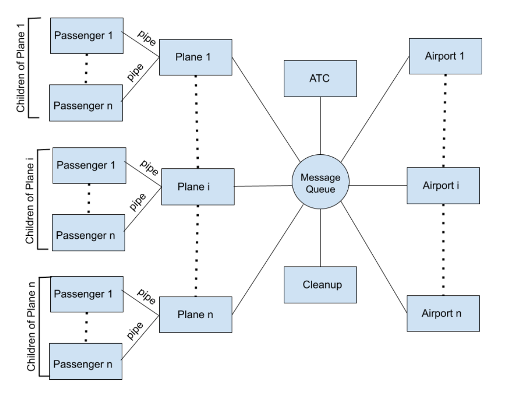

# Air Traffic Control System

## Overview
This project is a simulation of an Air Traffic Control (ATC) system using POSIX-compliant C programs. The system includes several processes representing planes, airports, an air traffic controller, passengers, and a cleanup process. Each entity communicates using inter-process communication (IPC) techniques.

## Project Structure

The system consists of the following components:

1. **Plane Process (`plane.c`):** 
   - Simulates passenger and cargo planes.
   - Handles user inputs for plane details such as type, weight, and passenger information.
   - Manages IPC with passenger processes and the air traffic controller.

2. **Air Traffic Controller Process (`airtrafficcontroller.c`):** 
   - Directs planes to airports and manages their journey.
   - Communicates with plane and airport processes via a single message queue.
   - Logs flight details and handles termination requests.

3. **Airport Process (`airport.c`):** 
   - Simulates airports with multiple runways.
   - Manages plane arrivals and departures.
   - Ensures planes use the appropriate runways based on their weight.

4. **Cleanup Process (`cleanup.c`):** 
   - Monitors the system and handles termination requests.
   - Ensures a graceful shutdown of the entire system.

## Features
- Simulates both passenger and cargo planes.
- Utilizes multi-threading for airport operations.
- Ensures safe communication between processes using message queues and pipes.
- Includes a logging mechanism for tracking plane movements.

### Compilation
To compile the programs, run:
```sh
gcc plane.c -o plane.out -lpthread
gcc airtrafficcontroller.c -o airtrafficcontroller.out -lpthread
gcc airport.c -o airport.out -lpthread
gcc cleanup.c -o cleanup.out -lpthread
```

### Execution
1. **Start the Air Traffic Controller:**
   ```sh
   ./airtrafficcontroller.out
   ```

2. **Start Airport Processes:**
   ```sh
   ./airport.out
   ```

3. **Start Plane Processes:**
   ```sh
   ./plane.out
   ```

4. **Start Cleanup Process:**
   ```sh
   ./cleanup.out
   ```

### Usage
Each program will prompt the user for the necessary inputs. Follow the on-screen instructions to simulate the operations of the ATC system.

### Plane Process
- Input the plane ID.
- Specify whether the plane is a passenger (1) or cargo (0).
- Enter the number of occupied seats (for passenger planes) or the number of cargo items (for cargo planes).
- Enter luggage and body weights for passengers or the average weight of cargo items.
- Provide the departure and arrival airport numbers.

### Air Traffic Controller Process
- Input the number of airports to manage.

### Airport Process
- Input the airport number and the number of runways.
- Specify the load capacity for each runway.

### Cleanup Process
- Monitor the system and decide when to terminate the simulation.

## Details
For more details on the implementation, refer to the comments in the source code files.
